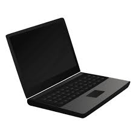

# 💻 Registro de laptop

Proyecto desarrollado en Rust + Anchor para registrar información básica de una laptop
(por ejemplo, Marca, modelo, procesador,generacion y año).

La idea es tener un registro seguro, inmutable y descentralizado del registro laptops
para que no se pueda borrar.

# 🛠️ Tecnologias y Herramientas

